# Women's wellness warriors

### [Live Site](https://alcl2000.github.io/womenswellnesswarriors/)

Our app, 'Dot.' created for the CodeInstitute Women's Wellness hybrid hackathon

## Project Goals

- Dot. is an app designed to make period tracking easy and display information in an accessible format
- Enhance users' understanding of their menstrual health by providing educational resources and insights into common symptoms, cycle patterns, and wellness practices.
- Promote inclusivity and accessibility by designing the app to be user-friendly for individuals of all ages, genders, and backgrounds, with consideration for diverse cultural perspectives and experiences.
- Provide accurate predictions and insights into users' menstrual cycles, enabling them to plan and prepare for their periods and associated symptoms.

### User stories 
 - As a user, I want to be able to easily log my menstrual cycle start and end dates, so I can accurately track my period over time.
  - Need effectively met through the "Dot" quiz and calender
- As a user, I want the app to provide insights and predictions about my cycle based on the data I input, so I can plan activities and events accordingly.
 - Need met with the addition of advice and symptom reminders on the side of the dot page, for users to gain a greater understanding of their cycle
- As a user, I want access to educational resources about menstrual health and wellness, so I can learn more about my body and how to care for it during my cycle.
 - Need met with the addition of advice columns on the side
- As a user, I want the app to offer customizable settings for cycle length and fertility tracking, so it can adapt to my individual needs and preferences.
 - User is able to change the length of their period and cycle if it falls outside of median parameters

## Design

- Colour Palette 

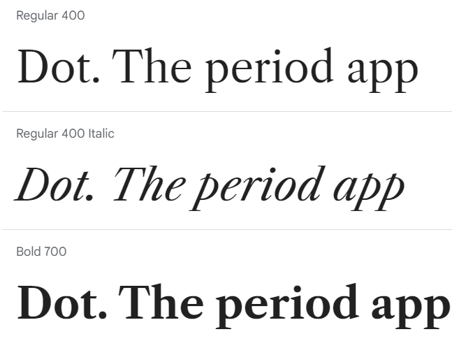
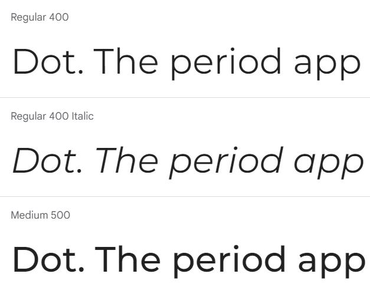
###  Wireframes
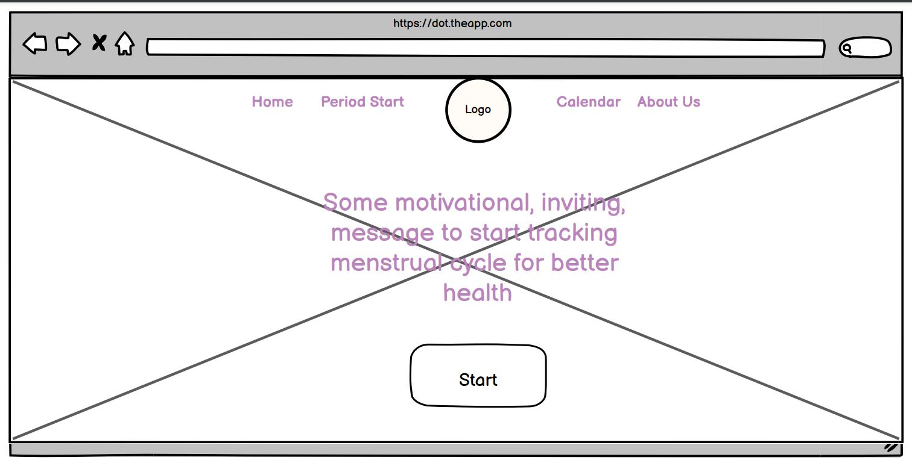
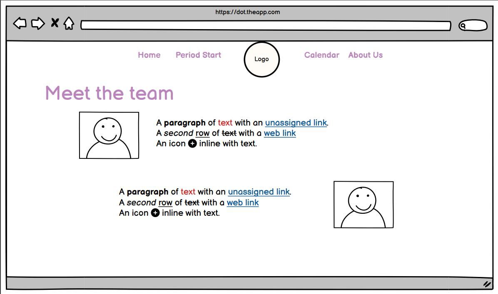

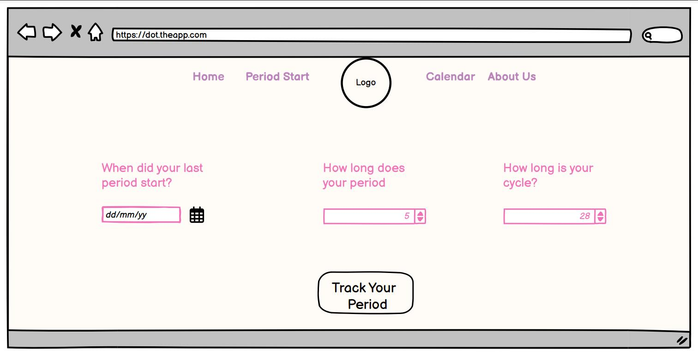

### Features
- Landing page
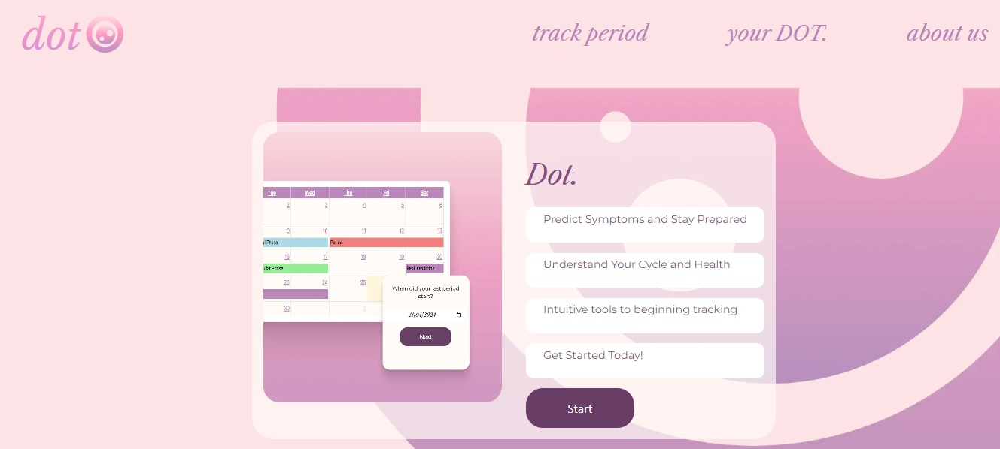

On landing page there's an informative box where information are found why is good to track the menstrual cycle, what you expect to get once you start using the webpage and the START button which will take the user to the form page to insert data.

- Form page and input fields
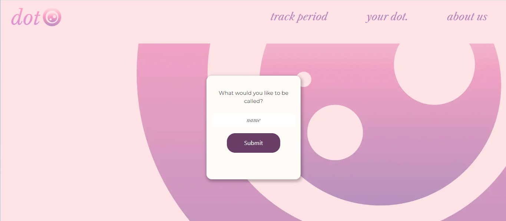
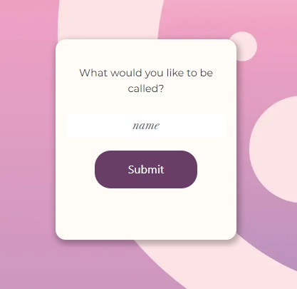
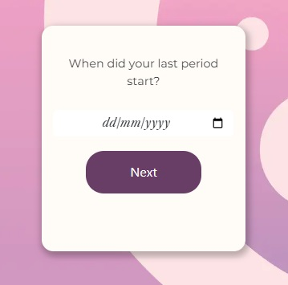
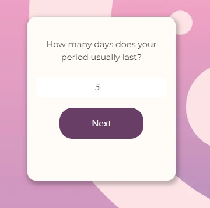
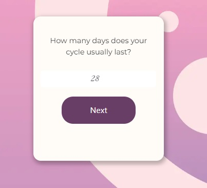

The Form page will populate some input fields, one at the time requesting the name of the user, the date the period starts, how long the period lasts and how long the cycle is. These data will then be stored in LOCAL STORAGE as an array object so it can be used for feuture implementations.

- Calendar page
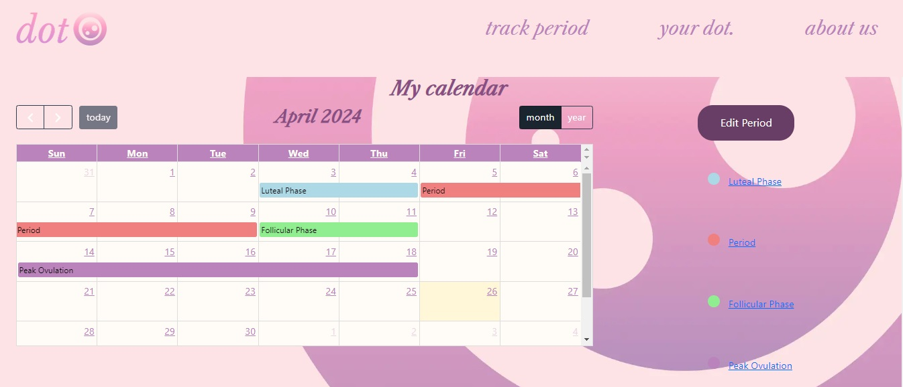
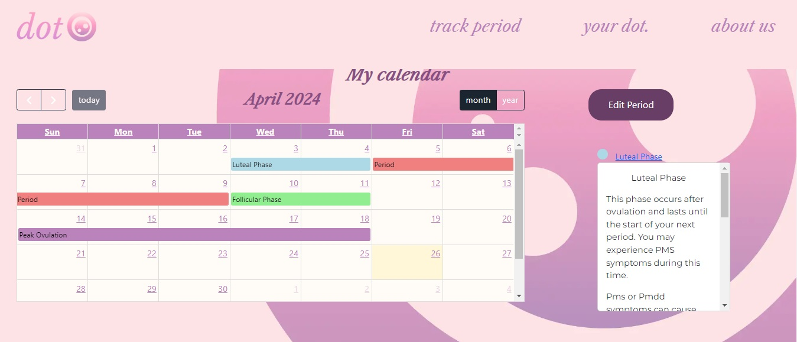

In the calendar page the user can see their mesrtual cycle with some information regarding each phase. When the links on the site are clicked the information regarding that phase are shown.

- About Us

The team who build the webpage with links in GitHUb and LinkIn.

### Future Features

Due to time constraints, not all of our planned features could make into the final app. Had we had more time, these features could have been added to improve the app

#### Circle tracker 
- A circular tracker would have been implemented alongside the existing calender to make viewing the various phases of the menstrual cycle easier and more intuitive

### Bugs 

- Background colour
    - The background colour was too vivid and made text difficult to read
    - The chosen image selected for our background did not stretch efficiently and did not tesselate, a different image was chosen
- Git troubles
    - The repository was not initialised with a .gitignore file which meant that when necessary add ins were installed, all of the node packages were installed with them
-Circular tracker not tracking date 
    - The circular trackers we chose had no function to implement date tracking and as such could not effectively track a user's place in their cycle
- Links
    - Links in the navbar were configured incorrectly, and were rewrtitten to ensure no 404 errors
- Footer
    - The footer floats on several pages due to our use of flex boxes 

### Tools Used

[Sweet Alert](https://sweetalert2.github.io/)  
[Bootstrap](https://getbootstrap.com/)  
[Google Fonts](https://fonts.google.com/)  
[FullCalendar](https://fullcalendar.io/)
[Circular Dial](https://codepen.io/robertkoons/pen/NByBMg)
[ChatGPT](https://chat.openai.com/) (for creation of the logo and various issue consulting)

